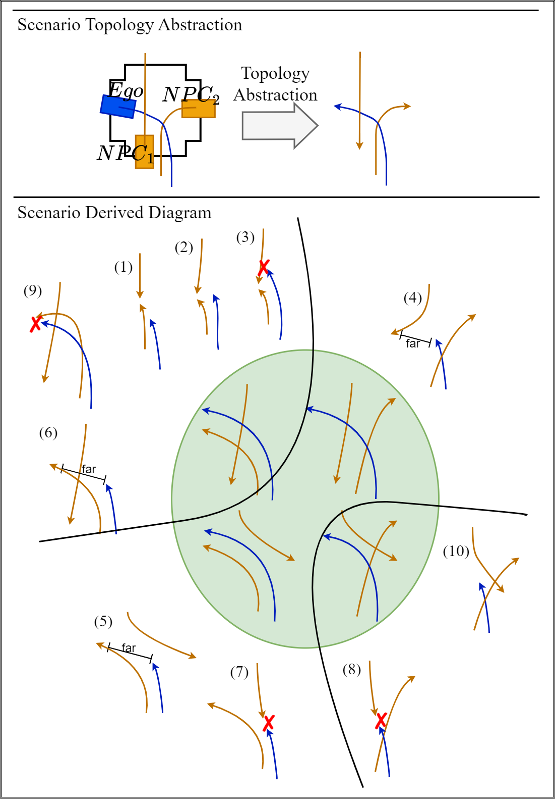

# DoFuzz

For detailed safety violation explanations, simulator logs, and scenario relationship diagrams, please refer to evaluation_results/.

## Safety Violation

To browse our testing results of test driving scenario {ADS}_{Driving-Tasks}, please refer to the corresponding directory `evaluation_results\{ADS}_{Driving-Tasks}`.

Option:
 - ADS - TCP, ...
 - Driving-Tasks - TL, ...

To replay Carla simulation logs, please [install Carla](https://carla.readthedocs.io/en/0.9.11/start_quickstart/) first and then refer to the [recorder document](https://carla.readthedocs.io/en/0.9.11/adv_recorder/) and the [replaying script](https://github.com/carla-simulator/carla/blob/0.9.11/PythonAPI/examples/start_replaying.py).

## Scenario Derived Diagram

Through a preliminary trajectory-topological analysis, we have discovered interesting relationships between all types of scenarios, including safety-violation and normal driving ones. 

Taking test driving scenario TCP_TL (TCP driving for the task of TL) for example, these scenarios can be viewed as derived from four basic types of normal driving scenarios. This makes sense as our fuzzer does subtly perturb controlled environments to uncover potential corner cases, which demonstrates the advantage of the simulation-based ADS fuzzing technique.

