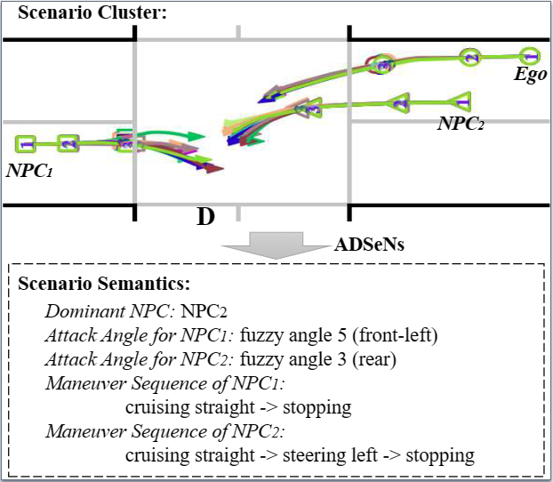

# Test Input Prioritization (TIP)

## Scenario Semantics

Scenario semantics are domain-specific, and their extraction requires significant domain knowledge. We mine three types of semantic information as follows:

- **Dominant NPC** refers to the closest *NPC vehicle*  to the *Ego vehicle*  if *Ego vehicle*  fails to complete the route mission. Existing approaches commonly measure *Ego vehicle*’s minimum distance to *NPC vehicles* as violation feedback [ 1, 10 , 23 , 35 , 42 ]. Taking it one step further, we argue that different closest NPC vehicle implies different cause of failure. Such semantics is computed by placing an *Ego vehicle* bounding box on each waypoint and then comparing the distance with the bounding boxes of all *NPC vehicles*. To adapt such semantics to normal scenarios, we specify null to indicate that *Ego vehicle* succeeds in route completion.
- **Attack Angle** represents the direction of *Ego vehicle* from the perspective of an *NPC vehicle*. Relative orientation (front, rear, and side) between vehicles has been considered in previous works [ 16, 20 ] for accident attribution. To indicate these directions, as shown in Fig. 6, we define six fuzzy angles, each occupying sixty degrees. We aim to utilize the fuzzy angle to indicate the critical body part of an *NPC vehicle* that physically or remotely affects *Ego vehicle*.
- **Motion Sequence** indicates how a vehicle moves on the road. It reflects the driving intentions of a vehicle which may trigger the reactions of other vehicles, leading to various interactions between vehicles [43 ]. Four types of motions are detected on the whole waypoint sequence of a vehicle: cruising straight, steering left, steering right, and stopping, making up a variable-length (𝑘′-length) motion sequence after removing adjacent duplication.

We choose the above semantic information because they characterize the representative patterns of safety-violating scenarios, making it possible to obtain fine-grained types of corner cases. We demonstrate that the semantic information can characterize meaningful violation features for safety-violating scenarios and thus provide insights for manual scenario inspection with a **case study**. Besides, semantic information can be adapted to normal cases to obtain fine-grained types of normal cases so that we can adopt a generic *Exception Score* (ES) estimation for all test inputs. If not consider normal case clusters, the Fuzzer is likely to always assign high *ES* to normal cases, deferring the execution of corner cases.

## Case Study

Figure 14: A cluster of safety-violating scenarios and their scenario semantics extracted by DoFuzz in the test setting of $InterFuser_{TL}$. Each scenario contains three vehicle trajectories, printed in a unique color.

We analyze a cluster of concrete test scenarios to better understand what safety-violating test scenarios look like, what are the failures of ADS in these scenarios, and how to determine the potential design deficiencies in ADS. 

Fig. 14 reports a cluster of safety-violating scenarios with sce- nario semantics extracted by DoFuzz. At the start of each scenario (from time stamp 1 to 2), three vehicles are accelerating and keeping in their lanes. Vehicle $NPC_2$ enters the intersection and attempts an unprotected left turn but collides with oncoming vehicle $NPC_1$, causing them to stop at the intersection. Normally, *Ego vehicle* should avoid this obstacle, but instead, it approaches vehicle $NPC_2$ closely. In summary, this type of failure occurs when *Ego vehicle* fails to avoid the front accident vehicle during left turn, resulting in a near miss at the intersection. 

Next, we demonstrate the utility of scenario clusters and semantics in ADS developments, providing engineers with valuable insights into failures and design deficiencies of ADS. First, given a cluster of scenarios exposing the same failure, developers gain stronger convictions about the risk, ruling out contingencies. Second, the trigger condition and coverage of the risk can be identified. For example, Fig. 14 reveals that the accident vehicle affecting *Ego vehicle* stops on its left turn path specifically. This eliminates subjectivity and enables a more precise determination of the failure. Third, the scenario semantics captures available information, aiding in speculating potential design deficiencies in ADS. For instance, considering the **Dominant NPC** ($NPC_2$) and its **Attack Angle**, it is more likely that the ADS has issues with road occupancy estimation or vehicle size detection. Such information is valuable for engineers to re-engineer or re-train their ADS. In addition to the current design, we discover that extra semantics information, like route completion rate, is relevant in failure inspection as well. We intend to conduct further studies in future work.

[1] Yasasa Abeysirigoonawardena, Florian Shkurti, and Gregory Dudek. 2019. Gen- erating adversarial driving scenarios in high-fidelity simulators. In 2019 Interna- tional Conference on Robotics and Automation (ICRA). IEEE, 8271–8277.

[10] Wenhao Ding, Baiming Chen, Bo Li, Kim Ji Eun, and Ding Zhao. 2021. Multimodal safety-critical scenarios generation for decision-making algorithms evaluation. IEEE Robotics and Automation Letters 6, 2 (2021), 1551–1558.

[16] Zhisheng Hu, Shengjian Guo, Zhenyu Zhong, and Kang Li. 2021. Coverage- based scene fuzzing for virtual autonomous driving testing. arXiv preprint arXiv:2106.00873 (2021).

[20] Guanpeng Li, Yiran Li, Saurabh Jha, Timothy Tsai, Michael Sullivan, Siva Ku- mar Sastry Hari, Zbigniew Kalbarczyk, and Ravishankar Iyer. 2020. AV-FUZZER: Finding safety violations in autonomous driving systems. In 2020 IEEE 31st International Symposium on Software Reliability Engineering (ISSRE). IEEE, 25–36.

[23] Yixing Luo, Xiao-Yi Zhang, Paolo Arcaini, Zhi Jin, Haiyan Zhao, Fuyuki Ishikawa, Rongxin Wu, and Tao Xie. 2021. Targeting requirements violations of autonomous driving systems by dynamic evolutionary search. In 2021 36th IEEE/ACM International Conference on Automated Software Engineering (ASE). IEEE, 279–291.

[35] Yun Tang, Yuan Zhou, Tianwei Zhang, Fenghua Wu, Yang Liu, and Gang Wang. 2021. Systematic testing of autonomous driving systems using map topology-based scenario classification. In 2021 36th IEEE/ACM International Conference on Automated Software Engineering (ASE). IEEE, 1342–1346.

[42] Ziyuan Zhong, Gail Kaiser, and Baishakhi Ray. 2022. Neural network guided evolutionary fuzzing for finding traffic violations of autonomous vehicles.

[43] Deyao Zhu, Mohamed Zahran, Li Erran Li, and Mohamed Elhoseiny. 2020. Halent-net: Multimodal trajectory forecasting with hallucinative intents. In International Conference on Learning Representations.
