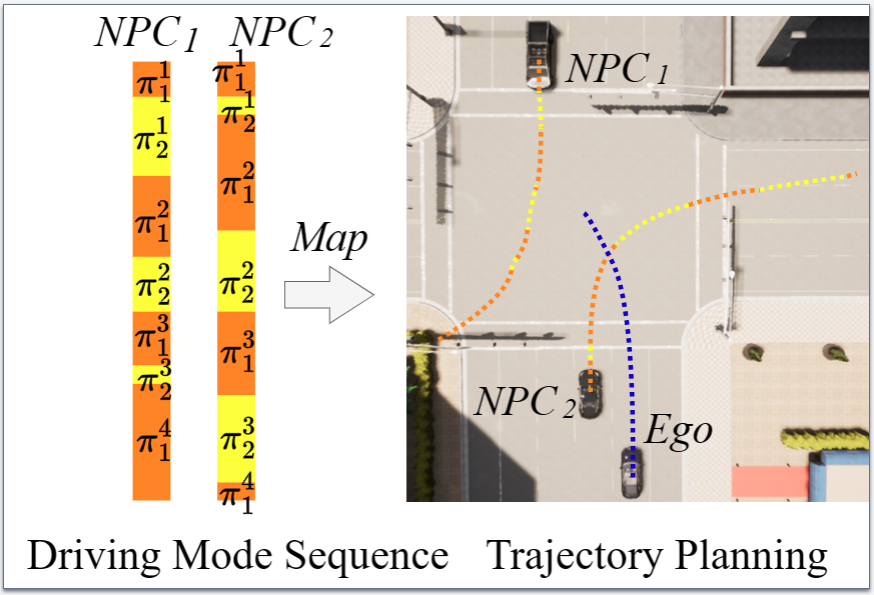
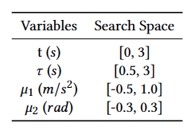

# Test Case Generation (TCG)

Figure 4: Movements of NPC vehicles. For each NPC vehicle, DoFuzz leverages the kinematic model *𝜋1(𝑡, 𝜇1, 𝜇2)* to compute trajectories in maneuver mode (orange), while leverages the trajectory forecasting model *𝜋2(𝜏)* to generate trajectories in cruise mode (yellow).

The variables: 𝑡 and 𝜏 indicate the duration to conduct the kinematic model and forecasting model, and 𝜇1, 𝜇2 are the kinematic model parameters, i.e., acceleration and steering angle.

